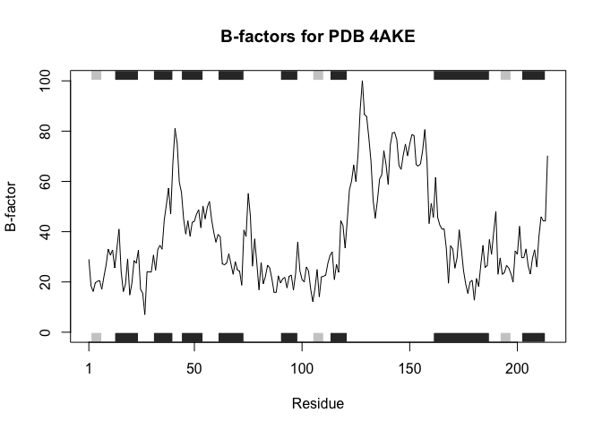
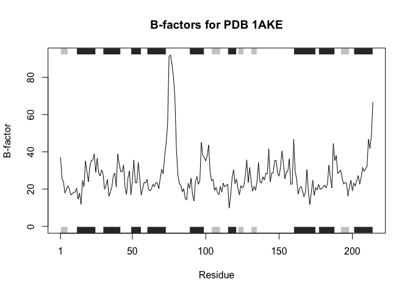
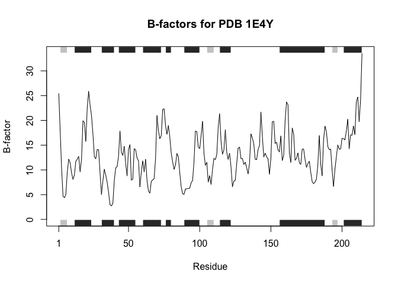

# Class6: BGGN
Lisanne Stouthart PID A69036187

## Quarto

Quarto enables you to weave together content and executable code into a
finished document. To learn more about Quarto see <https://quarto.org>.

## Running Code

My first function

``` r
add <- function(x, y) {
  x + y
  }
```

Can I just use it?

``` r
add(1,1)
```

    [1] 2

``` r
add(x=1, y=100)
```

    [1] 101

``` r
add(c(100,1,100),1)
```

    [1] 101   2 101

``` r
add(x=c(100,1,100), y=1)
```

    [1] 101   2 101

``` r
#add(10) #Missing argument Y
```

My second function. So if I next time don’t give Y argument, it will
still work

``` r
add <- function(x, y=1) {
  x + y
  }
```

``` r
#add(10)
#add(10,10) #you can still overwrite the y=1 of the original function

#add(1,1,1)
#add(1,1, z=1) #same error, you use an unused argument, you can modify your function
```

Let’s write a function to generate a random nucleotide sequence of any
length.

``` r
bases <- c("A", "C", "T", "G")

sample(bases, size = 2)
```

    [1] "G" "C"

``` r
#sample(bases, size = 5) #this gives error because you cannot take a sample larger then population, which in this case is 4.
sample(bases, size = 100, replace = TRUE)
```

      [1] "G" "A" "T" "A" "A" "T" "C" "G" "A" "T" "A" "C" "G" "G" "T" "C" "C" "T"
     [19] "C" "A" "A" "T" "G" "A" "T" "C" "C" "T" "A" "G" "C" "G" "C" "G" "A" "A"
     [37] "T" "A" "G" "C" "T" "A" "G" "G" "C" "G" "A" "G" "A" "A" "T" "A" "C" "C"
     [55] "C" "C" "G" "A" "A" "T" "G" "G" "T" "G" "G" "A" "C" "G" "C" "A" "C" "C"
     [73] "C" "T" "A" "G" "T" "T" "T" "G" "A" "C" "T" "G" "A" "C" "A" "C" "G" "C"
     [91] "G" "A" "A" "G" "A" "G" "A" "T" "C" "G"

``` r
sequence <- sample(bases, size = 100, replace = TRUE)
```

That is my wee working snipet now I can make it into a function

``` r
generate_dna <- function(length) {
  bases <- c("A", "C", "T", "G")
  sequence <- sample(bases, size = length, replace = TRUE)
  return(sequence) #to get your answer
}
```

``` r
generate_dna(10)
```

     [1] "G" "G" "A" "C" "T" "T" "A" "G" "T" "A"

``` r
generate_dna(length = 10)
```

     [1] "C" "T" "G" "A" "G" "C" "C" "T" "T" "C"

``` r
# Install the bio3d package
#install.packages("bio3d")

# Load the bio3d library
#library(bio3d)

# Check the version of the bio3d package
#package_version("bio3d")

bio3d::aa.table #all what we want is the 3 letter code
```

        aa3 aa1    mass       formula                             name
    ALA ALA   A  71.078    C3 H5 N O1                          Alanine
    ARG ARG   R 157.194  C6 H13 N4 O1                         Arginine
    ASN ASN   N 114.103   C4 H6 N2 O2                       Asparagine
    ASP ASP   D 114.079    C4 H4 N O3                    Aspartic Acid
    CYS CYS   C 103.143  C3 H5 N O1 S                          Cystein
    GLN GLN   Q 117.126   C4 H9 N2 O2                        Glutamine
    GLU GLU   E 128.106    C5 H6 N O3                    Glutamic Acid
    GLY GLY   G  57.051    C2 H3 N O1                          Glycine
    HIS HIS   H 137.139   C6 H7 N3 O1                        Histidine
    ILE ILE   I 113.158   C6 H11 N O1                       Isoleucine
    LEU LEU   L 113.158   C6 H11 N O1                          Leucine
    LYS LYS   K 129.180  C6 H13 N2 O1                           Lysine
    MET MET   M 131.196  C5 H9 N O1 S                       Methionine
    PHE PHE   F 147.174    C9 H9 N O1                    Phenylalanine
    PRO PRO   P  97.115    C5 H7 N O1                          Proline
    SER SER   S  87.077    C3 H5 N O2                           Serine
    THR THR   T 101.104    C4 H7 N O2                        Threonine
    TRP TRP   W 186.210 C11 H10 N2 O1                       Tryptophan
    TYR TYR   Y 163.173    C9 H9 N O2                         Tyrosine
    VAL VAL   V  99.131    C5 H9 N O1                           Valine
    ABA ABA   X  85.104   C4 H7 N1 O1          alpha-aminobutyric acid
    ASH ASH   D 115.087    C4 H5 N O3            Aspartic acid Neutral
    CIR CIR   R 157.170  C6 H11 N3 O2                       citrulline
    CME CME   C 179.260 C5 H9 N O2 S2 s,s-(2-hydroxyethyl)thiocysteine
    CMT CMT   C 115.154  C4 H5 N O1 S                 o-methylcysteine
    CSD CSD   C 134.134  C3 H4 N O3 S          s-cysteinesulfinic acid
    CSO CSO   C 119.142  C3 H5 N O2 S                s-hydroxycysteine
    CSW CSW   C 135.142  C3 H5 N O3 S               cysteine-s-dioxide
    CSX CSX   C 119.142  C3 H5 N O2 S                   s-oxy cysteine
    CYM CYM   C 102.135  C3 H4 N O1 S                 Cystein Negative
    CYX CYX   C 102.135  C3 H4 N O1 S                   Cystein SSbond
    DDE DDE   H 280.346 C13 H22 N5 O2                      diphthamide
    GLH GLH   E 129.114    C5 H7 N O3           Glutatmic acid Neutral
    HID HID   H 137.139   C6 H7 N3 O1                        Histidine
    HIE HIE   H 137.139   C6 H7 N3 O1                        Histidine
    HIP HIP   H 138.147   C6 H8 N3 O1               Histidine Positive
    HSD HSD   H 137.139   C6 H7 N3 O1                        Histidine
    HSE HSE   H 137.139   C6 H7 N3 O1                        Histidine
    HSP HSP   H 138.147   C6 H8 N3 O1               Histidine Positive
    IAS IAS   D 115.087    C4 H5 N O3                    beta-aspartyl
    KCX KCX   K 172.182  C7 H12 N2 O3        lysine nz-carboxylic acid
    LYN LYN   K 129.180  C6 H13 N2 O1                   Lysine Neutral
    MHO MHO   M 147.195  C5 H9 N O2 S                  s-oxymethionine
    MLY MLY   K 156.225  C8 H16 N2 O1                n-dimethyl-lysine
    MSE MSE   M 178.091 C5 H9 N O1 SE                 selenomethionine
    OCS OCS   C 151.141  C3 H5 N O4 S            cysteinesulfonic acid
    PFF PFF   F 165.164  C9 H8 F N O1         4-fluoro-l-phenylalanine
    PTR PTR   Y 243.153 C9 H10 N O5 P                o-phosphotyrosine
    SEP SEP   S 167.057  C3 H6 N O5 P                    phosphoserine
    TPO TPO   T 181.084  C4 H8 N O5 P                 phosphothreonine

``` r
bio3d::aa.table$aa1 #all what we want is the 3 letter code
```

     [1] "A" "R" "N" "D" "C" "Q" "E" "G" "H" "I" "L" "K" "M" "F" "P" "S" "T" "W" "Y"
    [20] "V" "X" "D" "R" "C" "C" "C" "C" "C" "C" "C" "C" "H" "E" "H" "H" "H" "H" "H"
    [39] "H" "D" "K" "K" "M" "K" "M" "C" "F" "Y" "S" "T"

``` r
unique(bio3d::aa.table$aa1)[1:20]
```

     [1] "A" "R" "N" "D" "C" "Q" "E" "G" "H" "I" "L" "K" "M" "F" "P" "S" "T" "W" "Y"
    [20] "V"

``` r
aa <- unique(bio3d::aa.table$aa1)[1:20]
```

Generate random protein sequence of length 6-13

``` r
generate_protein <- function(length) {
  aa <- unique(bio3d::aa.table$aa1)[1:20]
  sequence <- sample(aa, size = length, replace = TRUE)
  return(sequence) #to get your answer
}
```

``` r
generate_protein(10)
```

     [1] "C" "W" "M" "T" "C" "E" "F" "N" "N" "M"

``` r
generate_protein(length = 10)
```

     [1] "P" "C" "F" "N" "M" "Y" "V" "Q" "R" "N"

``` r
generate_protein(6)
```

    [1] "F" "D" "Q" "D" "T" "L"

``` r
generate_protein(7)
```

    [1] "G" "A" "D" "D" "K" "W" "I"

To get sequences one by one is boring. So generate random protein
sequences of length 6 to 12

``` r
#sapply(vector, function)
sapply(6:12, generate_protein) #you can not easy paste this somewhere because of the ""
```

    [[1]]
    [1] "P" "M" "H" "Y" "Y" "W"

    [[2]]
    [1] "D" "W" "T" "M" "W" "C" "V"

    [[3]]
    [1] "Y" "W" "G" "C" "Y" "P" "Q" "S"

    [[4]]
    [1] "M" "A" "S" "M" "I" "G" "K" "P" "K"

    [[5]]
     [1] "T" "E" "K" "F" "K" "F" "V" "G" "I" "T"

    [[6]]
     [1] "A" "A" "G" "G" "H" "S" "I" "V" "H" "L" "A"

    [[7]]
     [1] "F" "V" "M" "S" "R" "M" "R" "Y" "E" "Q" "Y" "K"

``` r
paste(c("barry", "alice"), "loves R", sep = "-")
```

    [1] "barry-loves R" "alice-loves R"

``` r
paste(c("barry", "alice"), "loves R", sep = "")
```

    [1] "barryloves R" "aliceloves R"

``` r
paste(c("barry", "alice"), "loves R")
```

    [1] "barry loves R" "alice loves R"

``` r
generate_protein <- function(length) {
  aa <- unique(bio3d::aa.table$aa1)[1:20]
  sequence <- sample(aa, size = length, replace = TRUE)
  sequence <- paste(sequence, collapse = "")
  return(sequence) #to get your answer
}

sapply(6:12, generate_protein)
```

    [1] "FNGTPN"       "TNYQDAG"      "HLSWDSGM"     "KRHIITFQE"    "DKGHNGRNDR"  
    [6] "VCCKWQQKAKV"  "TKPPHCKKKVQW"

``` r
answer <- sapply(6:12, generate_protein)
answer
```

    [1] "KMIPMN"       "EEADNCD"      "WLLHGRYF"     "MDGVTPYIL"    "HWCITDFTGP"  
    [6] "QWFTRPCDTVR"  "WKFGMPCDRVGG"

FASTA formatting

``` r
paste(">id.",6:12) #we don't want spaces
```

    [1] ">id. 6"  ">id. 7"  ">id. 8"  ">id. 9"  ">id. 10" ">id. 11" ">id. 12"

``` r
paste(">id.",6:12, sep = "") 
```

    [1] ">id.6"  ">id.7"  ">id.8"  ">id.9"  ">id.10" ">id.11" ">id.12"

``` r
paste(">id.",6:12, answer, sep = "") #but now we want everything on new line
```

    [1] ">id.6KMIPMN"        ">id.7EEADNCD"       ">id.8WLLHGRYF"     
    [4] ">id.9MDGVTPYIL"     ">id.10HWCITDFTGP"   ">id.11QWFTRPCDTVR" 
    [7] ">id.12WKFGMPCDRVGG"

``` r
paste(">id.", 6:12, "\n", answer, sep = "")
```

    [1] ">id.6\nKMIPMN"        ">id.7\nEEADNCD"       ">id.8\nWLLHGRYF"     
    [4] ">id.9\nMDGVTPYIL"     ">id.10\nHWCITDFTGP"   ">id.11\nQWFTRPCDTVR" 
    [7] ">id.12\nWKFGMPCDRVGG"

``` r
cat(paste(">id.", 6:12, "\n", answer, sep = "")) #but we want to look like fasta
```

    >id.6
    KMIPMN >id.7
    EEADNCD >id.8
    WLLHGRYF >id.9
    MDGVTPYIL >id.10
    HWCITDFTGP >id.11
    QWFTRPCDTVR >id.12
    WKFGMPCDRVGG

``` r
cat(paste(">id.", 6:12, "\n", answer, sep = ""), sep="\n")
```

    >id.6
    KMIPMN
    >id.7
    EEADNCD
    >id.8
    WLLHGRYF
    >id.9
    MDGVTPYIL
    >id.10
    HWCITDFTGP
    >id.11
    QWFTRPCDTVR
    >id.12
    WKFGMPCDRVGG

## HOMEWORK:

``` r
# How would you generalize the original code above to work with any set of input protein structures?
library(bio3d)
```

    Warning: package 'bio3d' was built under R version 4.3.3

``` r
bio3d::aa.table
```

        aa3 aa1    mass       formula                             name
    ALA ALA   A  71.078    C3 H5 N O1                          Alanine
    ARG ARG   R 157.194  C6 H13 N4 O1                         Arginine
    ASN ASN   N 114.103   C4 H6 N2 O2                       Asparagine
    ASP ASP   D 114.079    C4 H4 N O3                    Aspartic Acid
    CYS CYS   C 103.143  C3 H5 N O1 S                          Cystein
    GLN GLN   Q 117.126   C4 H9 N2 O2                        Glutamine
    GLU GLU   E 128.106    C5 H6 N O3                    Glutamic Acid
    GLY GLY   G  57.051    C2 H3 N O1                          Glycine
    HIS HIS   H 137.139   C6 H7 N3 O1                        Histidine
    ILE ILE   I 113.158   C6 H11 N O1                       Isoleucine
    LEU LEU   L 113.158   C6 H11 N O1                          Leucine
    LYS LYS   K 129.180  C6 H13 N2 O1                           Lysine
    MET MET   M 131.196  C5 H9 N O1 S                       Methionine
    PHE PHE   F 147.174    C9 H9 N O1                    Phenylalanine
    PRO PRO   P  97.115    C5 H7 N O1                          Proline
    SER SER   S  87.077    C3 H5 N O2                           Serine
    THR THR   T 101.104    C4 H7 N O2                        Threonine
    TRP TRP   W 186.210 C11 H10 N2 O1                       Tryptophan
    TYR TYR   Y 163.173    C9 H9 N O2                         Tyrosine
    VAL VAL   V  99.131    C5 H9 N O1                           Valine
    ABA ABA   X  85.104   C4 H7 N1 O1          alpha-aminobutyric acid
    ASH ASH   D 115.087    C4 H5 N O3            Aspartic acid Neutral
    CIR CIR   R 157.170  C6 H11 N3 O2                       citrulline
    CME CME   C 179.260 C5 H9 N O2 S2 s,s-(2-hydroxyethyl)thiocysteine
    CMT CMT   C 115.154  C4 H5 N O1 S                 o-methylcysteine
    CSD CSD   C 134.134  C3 H4 N O3 S          s-cysteinesulfinic acid
    CSO CSO   C 119.142  C3 H5 N O2 S                s-hydroxycysteine
    CSW CSW   C 135.142  C3 H5 N O3 S               cysteine-s-dioxide
    CSX CSX   C 119.142  C3 H5 N O2 S                   s-oxy cysteine
    CYM CYM   C 102.135  C3 H4 N O1 S                 Cystein Negative
    CYX CYX   C 102.135  C3 H4 N O1 S                   Cystein SSbond
    DDE DDE   H 280.346 C13 H22 N5 O2                      diphthamide
    GLH GLH   E 129.114    C5 H7 N O3           Glutatmic acid Neutral
    HID HID   H 137.139   C6 H7 N3 O1                        Histidine
    HIE HIE   H 137.139   C6 H7 N3 O1                        Histidine
    HIP HIP   H 138.147   C6 H8 N3 O1               Histidine Positive
    HSD HSD   H 137.139   C6 H7 N3 O1                        Histidine
    HSE HSE   H 137.139   C6 H7 N3 O1                        Histidine
    HSP HSP   H 138.147   C6 H8 N3 O1               Histidine Positive
    IAS IAS   D 115.087    C4 H5 N O3                    beta-aspartyl
    KCX KCX   K 172.182  C7 H12 N2 O3        lysine nz-carboxylic acid
    LYN LYN   K 129.180  C6 H13 N2 O1                   Lysine Neutral
    MHO MHO   M 147.195  C5 H9 N O2 S                  s-oxymethionine
    MLY MLY   K 156.225  C8 H16 N2 O1                n-dimethyl-lysine
    MSE MSE   M 178.091 C5 H9 N O1 SE                 selenomethionine
    OCS OCS   C 151.141  C3 H5 N O4 S            cysteinesulfonic acid
    PFF PFF   F 165.164  C9 H8 F N O1         4-fluoro-l-phenylalanine
    PTR PTR   Y 243.153 C9 H10 N O5 P                o-phosphotyrosine
    SEP SEP   S 167.057  C3 H6 N O5 P                    phosphoserine
    TPO TPO   T 181.084  C4 H8 N O5 P                 phosphothreonine

``` r
b_factors_for_pdb <- function(pdb_id, chain = "A", elety = "CA") {
  # Read and trim the PDB file
  chain_data <- trim.pdb(read.pdb(pdb_id), chain = chain, elety = elety)
  # Extract B-factors
  extractB <- chain_data$atom$b
  # Plot B-factors
  plotb3(extractB, sse = chain_data, typ = "l", ylab = "B-factor",
         main = paste("B-factors for PDB", pdb_id))
}

b_factors_for_pdb("4AKE")
```

      Note: Accessing on-line PDB file



``` r
b_factors_for_pdb("1AKE")
```

      Note: Accessing on-line PDB file
       PDB has ALT records, taking A only, rm.alt=TRUE



``` r
b_factors_for_pdb("1E4Y")
```

      Note: Accessing on-line PDB file



``` r
#Or make it all in 1 line
sapply(c("4AKE", "1AKE", "1E4Y"), b_factors_for_pdb)
```

      Note: Accessing on-line PDB file

    Warning in get.pdb(file, path = tempdir(), verbose = FALSE):
    /var/folders/wc/y60y10bj5jz0zzxkrq739z580000gn/T//RtmpvRGcny/4AKE.pdb exists.
    Skipping download

      Note: Accessing on-line PDB file

    Warning in get.pdb(file, path = tempdir(), verbose = FALSE):
    /var/folders/wc/y60y10bj5jz0zzxkrq739z580000gn/T//RtmpvRGcny/1AKE.pdb exists.
    Skipping download


       PDB has ALT records, taking A only, rm.alt=TRUE

      Note: Accessing on-line PDB file

    Warning in get.pdb(file, path = tempdir(), verbose = FALSE):
    /var/folders/wc/y60y10bj5jz0zzxkrq739z580000gn/T//RtmpvRGcny/1E4Y.pdb exists.
    Skipping download


    $`4AKE`
    NULL

    $`1AKE`
    NULL

    $`1E4Y`
    NULL
